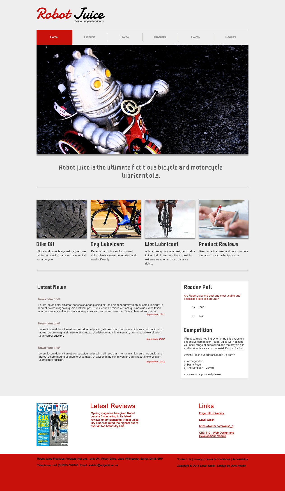
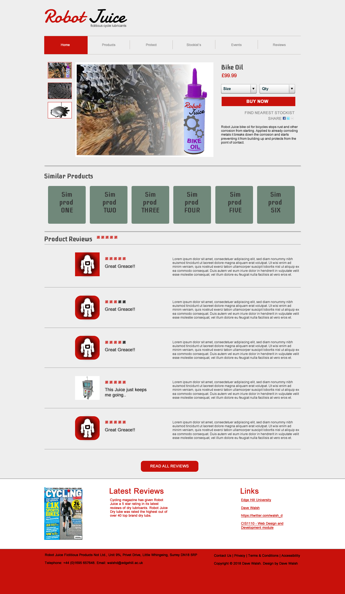

# Robot Juice Uni Year 1 Project

 This project was tasked as an end of 1st year coursework worth 80% of the whole module. We were given 2 jpg images of what the site should look like, a style guide that included all colours, fonts and logo specifications, and a folder containing images for the website. For this project we had around 10 weeks to complete, while completing other coursework for this and other modules. The brief was to build a website that demonstrated 5 features. the first two features are the two pages themselves following the designs provided. an index/home page and a product page. these should have a uniform header, nav bar and footer. these should also link to each other via the nav bar. The third feature comprises of two CSS files, one for grid and flexbox structure and one for the general styling of the two pages. The fourth feature is a JavaScript file that calls a JSON API link that contains an array of data, thi sis to be used as product reviews on the product page. The fifth and final feature is another JavaScript file, this is going to handle the poll feature on the home page.

 The code should be cleanly laid out and be documented throughout so a reader knows exactly what everything does. There is also an accompanying report that is a brief outline of the project, any issues that arose and the rest comprises of testing documentation.

 Overall i got 94% for this project. the 6% i lost was on the report for testing documentation. The only problem with my website was the "hide reviews" button does not hide the reviews on the product page and there is a slight discrepancy in the footer. As this was the biggest project i had done to date (Feburay-April 2020) i am very happy with the outcome and incredibly pleased with the result i recieved. I feel this has put me in good stead to continue my studying in September 2020.

This is the assesment guide image provided by the university for the index page.
 

 This is the assesment guide image provided by the university for the product page.
 
